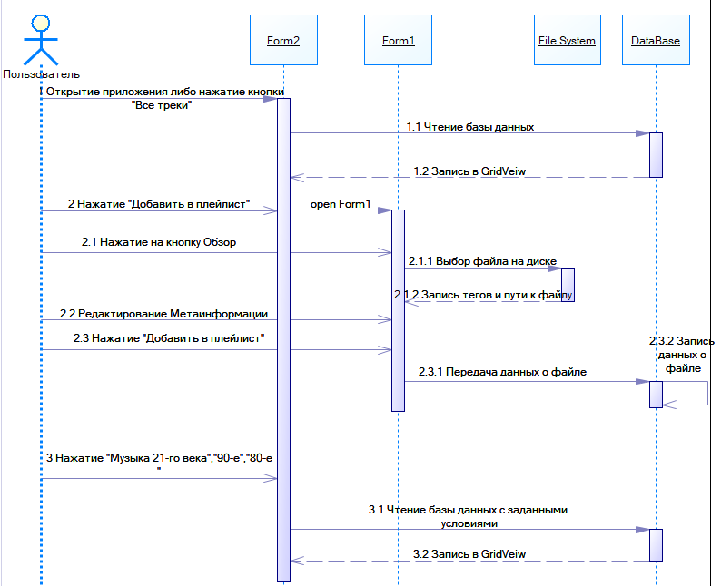

# Тестовое задание Nexign.
# UML диаграмма последовательности
## Легенда к диаграмме
### 1)Просмотр аудио фалов и их метоинформации(тегов)      

    1 Открытие приложения либо нажатие кнопки "Все треки"
      1.1 Чтение базы данных
      1.2 Запись в GridVeiw
### 2)Загрузка музыкальных файлов и редактирование их метаинформации
     2 Нажатие "Добавить в плейлист"(открытие новго окна)
      2.1 Нажатие на кнопку Обзор
        2.1.1 Выбор файла на диске
        2.1.2 Запись тегов и пути к файлу в (Labels и Textboxes)
      2.2 Редактирование Метаинформации загружаемых файлов (Изменение тестовых полей)
      2.3 Нажатие "Добавить в плейлист"
        2.3.1 Передача данных о файле (измененных при желании пользователя)
        2.3.2 Запись данных о файле
### 3)Составление плейлиста по желаемым параметрам
      3 Нажатие "Музыка 21-го века" или "90-e" или "80-e"
        3.1 Чтение базы данных с заданными условиями
        3.2 Запись в GridVeiw
    
     
      

## Цель работы:
### Реализовать следующие компоненты (модули) системы:
- фронт-энд (пользовательский интерфейс)
- бэк-энд
- база данные пользовательской информации
- библиотека метаинформацию
- файловое хранилище

### Система предоставляет пользователю функционал:
- загрузка музыкального файла, с последующим автоматическим распознаванием и дополнением метаинформацией (тегами)
- просмотр загруженных файлов и проставленной к ним метаинформации
- редактирование метаинформации у загруженных файлов
- составление плейлиста по введенным критериям.

## Программы и компоненты используешиеся для создания приложения:
### 1)	Visual Studio 2017 Professional
Использовалась для написания кода и создания интерфейса приложения (фронт-энд, бэк-энд)
### 2)	OpenServer (база данных)
Цель использования заключалась в том, чтобы создать локальный сервер, на котором была создана база данных, содержащая в себе все основные теги аудиофайлов и путь к ним в папку на жестком диске ПК.
### 3)	Библиотека TagLib-Sharp
Для “вытягивания” и редактирования тегов из аудиофайлов.
### 4)	Библиотека MySql.Data
Для соединения сервера с базой данных и приложения C#

## Описание приложения:
В приложении присутствует два окна, каждое из которых выполняет свои цели. 
## Окно1 Состоит из:
1)Плэйлист с музыкой, который берется из Базы данных на моем сервере.

2)Кнопок, создающих новые плейлисты по указанным критериям.  

  
 
Кнопки “Добавить трек в плейлист” открывающей Окно 2.

## Окно 2, Код которого представлен в файле Form1.cs отвечает за добавление новых треков в дата базу и  измениние метаинформации содержащийся в тегах аудиофайла.

Оно содержит: 
1)Кнопу обзор, которая открывает проводник и записывает путь до выбранного, “вытягивает” информацию из выбранного аудиофайла в текстовые поля и контейнеры.

3)  Контейнеры в которых записаны метаинформация из тегов. Данную информацию можно изменить на желаемую пользователю.
  

4) Кнопку “Добавить в плейлист”, которая записывает все данные из контейнеров (Путь к файлу, название, исполнителей и т.д.) в базу данных

База данных содержащаяся на сервере: 

Все возможности продемонстрированы в видео:
https://youtu.be/MA_5Q8CROfY

